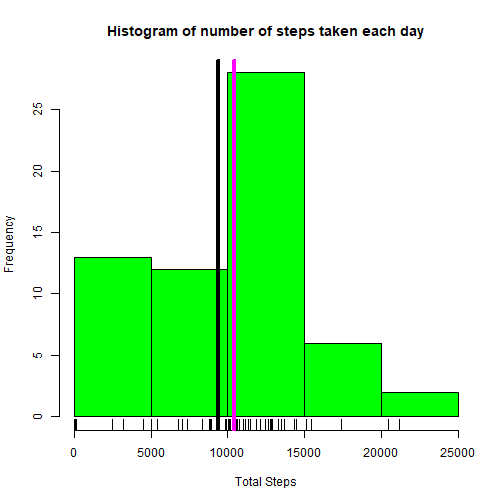
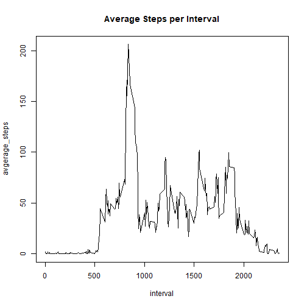
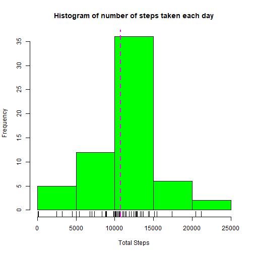
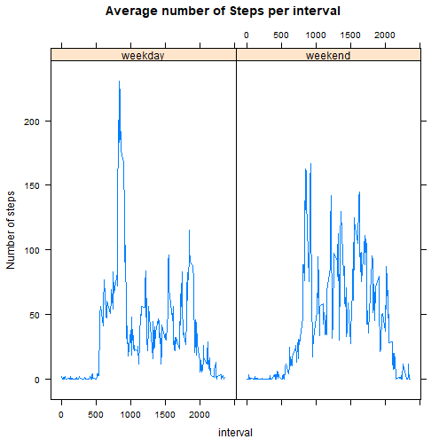

We need to load the following libraries: 

```r
library(dplyr)
library(chron)
library(lattice)
library(ggplot2)
```


## Loading and preprocessing the data
In the following script, we load the data using by the *read.csv* and the *unzip* functions, and save it into a variable called **data**. The zip file ("activity.zip") is already in the repo.  

```r
data <- read.csv(unzip("activity.zip", "activity.csv"))
str(data)
```

```
## 'data.frame':	17568 obs. of  3 variables:
##  $ steps   : int  NA NA NA NA NA NA NA NA NA NA ...
##  $ date    : Factor w/ 61 levels "2012-10-01","2012-10-02",..: 1 1 1 1 1 1 1 1 1 1 ...
##  $ interval: int  0 5 10 15 20 25 30 35 40 45 ...
```
As we see, the **date** variable is a factor. In the follwoing script, we transform it to a *Date* variable.

```r
data <- transform(data, date = as.Date(date))
str(data)
```

```
## 'data.frame':	17568 obs. of  3 variables:
##  $ steps   : int  NA NA NA NA NA NA NA NA NA NA ...
##  $ date    : Date, format: "2012-10-01" "2012-10-01" ...
##  $ interval: int  0 5 10 15 20 25 30 35 40 45 ...
```
Before going to the next step, let us see how many of the observations got missing values for each variables.

```r
stepsNA <- mean(is.na(data$steps)) *100
dateNA <- mean(is.na(data$date)) *100
intervalNA <- mean(is.na(data$interval)) *100
```
So, the proportion of NA values w.r.t the whole data in **steps**, **date**, and **interval** are 13%, 0%, and 0%, respectively.

## What is mean total number of steps taken per day?
We get "*the total number of steps taken per day*" by the following script. 

```r
stepsday <- data %>% group_by(date) %>% summarize(totalSteps = sum(steps, na.rm = TRUE))
stepsday
```

```
## # A tibble: 61 x 2
##    date       totalSteps
##    <date>          <int>
##  1 2012-10-01          0
##  2 2012-10-02        126
##  3 2012-10-03      11352
##  4 2012-10-04      12116
##  5 2012-10-05      13294
##  6 2012-10-06      15420
##  7 2012-10-07      11015
##  8 2012-10-08          0
##  9 2012-10-09      12811
## 10 2012-10-10       9900
## # ... with 51 more rows
```

Here is the "*histogram of the total number of steps taken each day*": 

```r
hist(stepsday$totalSteps, col = "green", breaks = 7, main = "Histogram of number of steps taken each day", xlab = "Total Steps")
rug(stepsday$totalSteps) 
abline(v = median(stepsday$totalSteps, na.rm = T), col = "magenta", lwd = 4)
abline(v = mean(stepsday$totalSteps, na.rm = T), lwd = 4)
```



In the following script, we calculate the "*mean and median of the total number of steps taken per day*". 

```r
stepsmean <- mean(stepsday$totalSteps)
stepsmedian <- median(stepsday$totalSteps)
```
The mean and median of total number of steps taken per day are **9354.2295082** and **10395**, respecitvely. The megenta and black vertical lines in the above histogram show them, respectively. 

## What is the average daily activity pattern?
The following script calculates the average number of steps, averaged across all days per interval. The result is shown in a plot.

```r
avgstpinv <- data %>% group_by(interval) %>% summarize(avgerage_steps = mean(steps, na.rm = TRUE))
plot(avgstpinv, type = "l", main = "Average Steps per Interval")
```



The following script gets the interval, which contains the maximum number of steps, averaged across all the days. 

```r
maxinvstp <- avgstpinv$interval[which(avgstpinv$avgerage_steps == max(avgstpinv$avgerage_steps))]
```

So, the interval, which contains the maximum number of average steps is **835**.

## Imputing missing values
The total number of **NA** rows in **data** is calculated as follows: 

```r
nanum <- sum(is.na(data))
nanum
```

```
## [1] 2304
```

The following script replaces the **NA** values in **steps** with the mean of all **steps** taken in the corresponding interval. We take advantage of the data frame created in the former stages. 


```r
for(i in 1:dim(data)[1]){
        if(is.na(data$steps)[i]){
                data$steps[i] <- avgstpinv[avgstpinv$interval == data$interval[i],]$avgerage_steps
        }
}
```
As we see now, in the following script, there is no missing values in our data anymore.

```r
sum(is.na(data))
```

```
## [1] 0
```

Now, here is the updated "*histogram of the total number of steps taken each day*". We first get the total number of steps taken per day and store the data in a data frame named **stepsday2**. 

```r
stepsday2 <- data %>% group_by(date) %>% summarize(totalSteps = sum(steps, na.rm = T))

hist(stepsday2$totalSteps, col = "green", main = "Histogram of number of steps taken each day", xlab = "Total Steps")
rug(stepsday2$totalSteps) 
abline(v = median(stepsday2$totalSteps), col = "magenta", lwd = 2, lty = 2)
```



```r
#abline(v = mean(stepsday2$totalSteps), lwd = 2)
meann <- mean(stepsday2$totalSteps)
mediann <-median(stepsday2$totalSteps)
```
As we see in the plot, the median and mean of the total steps per day are now eqaul: mean == 1.0766189 &times; 10<sup>4</sup>  == median.  


## Are there differences in activity patterns between weekdays and weekends?
In the following script, we create a factor variable, named **wday** in **data** with two levels -- "weekday" and "weekend"-- indicating whether a given date is a weekday or weekend day. 

```r
data$wdays <- weekdays(data$date)
for(i in 1:dim(data)[1]){
        if(data$wdays[i] == "Saturday" | data$wdays[i] == "Sunday") {
                data$wdays[i] <- "weekend"
        }
        else{
                data$wdays[i] <- "weekday"
        }
}
data$wdays <- as.factor(data$wdays)
```
Now, in the following script, we make a panel plot containing a time series plot of the interval (x-axis) and the average number of steps taken, averaged across all weekday days or weekend days (y-axis).

```r
avgstp <- data %>% group_by(wdays, interval) %>% summarize(avg_steps = mean(steps, na.rm = TRUE))
xyplot(avg_steps ~ interval | wdays, data = avgstp,  type = "l", ylab = "Number of steps", main = "Average number of Steps per interval")
```


